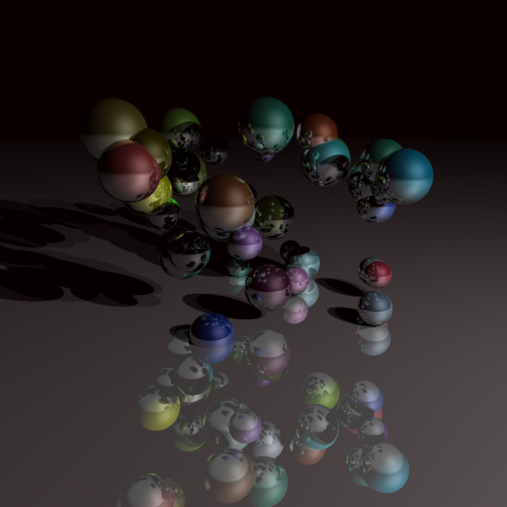
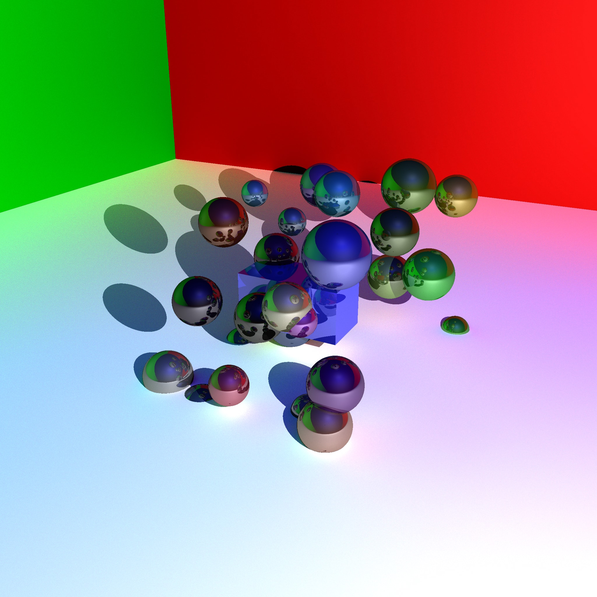
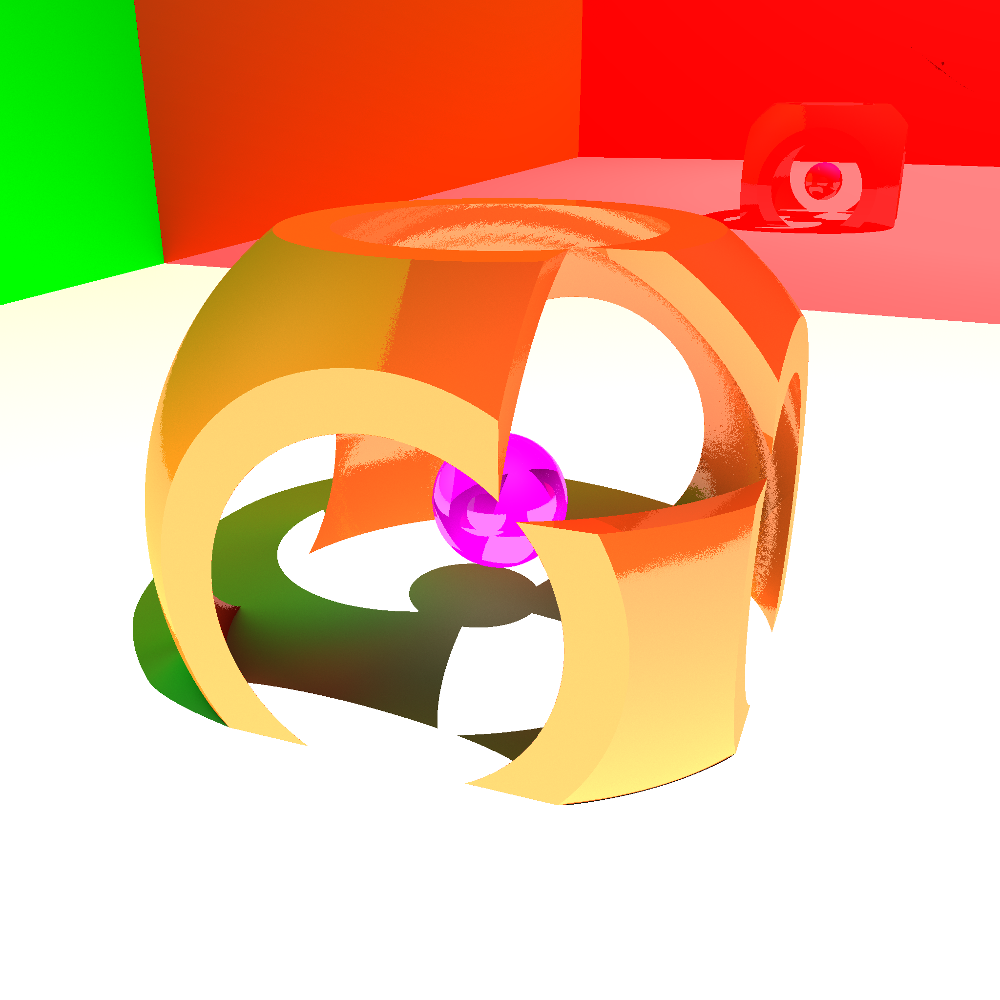

# Ray Tracing

  
As shown above, an example image of the application.
We can distinguish the spheres with all their different colors and reflections on the spheres and surrounding walls.

### Ray-Tracing algorithm overview
----

Ray-Tracing works by simulating real light rays and using an algorithm to trace back the path that actual light would take in the real world. 

Ray tracing-based rendering's popularity stems from its basis in a realistic simulation of light transport, as compared to other rendering methods, such as rasterization. Although it requires a more powerful computer to run. 

### Further information
----

All the objects inside the scenes are mathematical models of basic shapes (plane, square, rectangle, sphere). More complex shapes are the union and/or intersection of basic shapes.
This algorithm is capable of simulating the reflection, refraction, transparency, and colors of all objects inside the scene depending on the position and ligthing conditions.

The quality is inversely proportionate to the speed of execution of the Ray-Tracing algorithm.

### Installation and execution
----

> Tested for Linux systems.  
Open in a CMakeList compatible IDE.  
Run the project.  
Inside the application, use the Qt sliders/buttons to choose between the different scenes available and different scene qualities.  
You can access the DepthMap of the scene with the Shading and Toggle View button.  

### Dependencies
----

Needs CMakeLists.  
This code uses Qt : https://www.qt.io/download

### Screenshots
----
  
  
  
  
